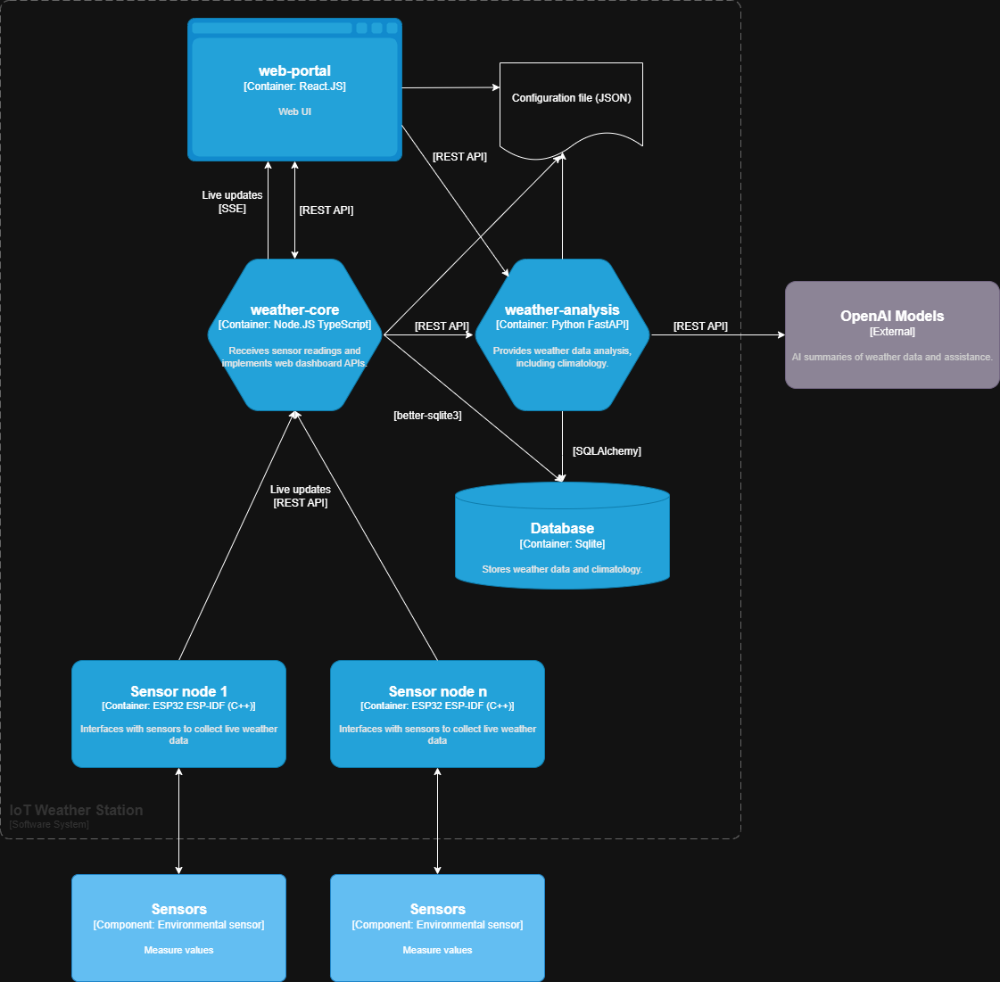

# Concept Design
## System Overview
The system comprises three logical layers:
1. Sensor layer (ESP32 nodes)
2. Backend layer (Node.JS and FastAPI web services)
3. Frontend layer (React frontend)

## System Architecture

## Requirements
REQ-1 - Sensor nodes - the system will support multiple sensor nodes. There will be at least one for temperature and humidity, one for precipitation, and one for wind.

REQ-2 - Sensor data acquisition - Sensor values will be read every 3 s for temperature and humidity, or as appropriate for the particular variable.

REQ-3 - Change detection - Sensor nodes will transmit data only when values change beyond tolerance (0.1 °C for temperature, 1 % for humidity, appropriate values for other variables).

REQ-4 - Communications protocol - Sensor nodes will transmit readings to the web server via REST API (HTTP).

REQ-5 - Data caching and resilience - Sensor nodes will continue to monitor the environment, storing any transmittable values in the event of a disconnection to the web server, syncing the data once communication is re-established.

REQ-6 - Minima and maxima - The web application will record daily minima and maxima (temperatures). These values will be stored as daily records in the database.

REQ-7 - Current conditions - The web application will provide a live display of current conditions, including temperature, humidity, and others.

REQ-8 - Past weather - The web application will be able to provide a summary of recent weather observations, including data and a textual summary.

REQ-9 - Exports - The web application will support exporting of daily weather records by calendar month in Excel format.

REQ-10 - Climatology - The web application will be able to analyse the collected weather data to produce climatological information.

REQ-11 - Alerts - The web application will send email and/or SMS alerts when temperature reaches thresholds. These alerts will be configurable.

REQ-12 - Future extensibility - The web application and sensor node software will be extensible to easily support additional future sensors.

REQ-13 - Security - Communication between the sensor nodes and web server will use authentication tokens and HTTPS to prevent unauthorised data injection.

REQ-14 - Data validation and integrity - the web application will validate the received data and discard or flag values that fall outside realistic physical limits.

REQ-15 - Node heartbeat - each node will send a periodic heartbeat message every 60 s to confirm connectivity even when measurements are stable.