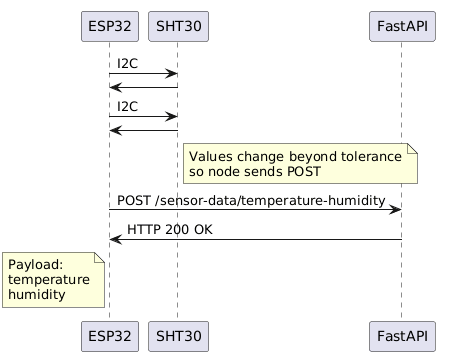

# Detailed design

- All temperature values shall be in degrees celsius.

## Configuration File
REQ-DX - The web application will use a JSON configuration file to store metadata about the weather station:

|Field|Type|Units|Required|Description|
|-----|----|-----|-----------|----|
|`station_name`|string|N/A|Yes|Human-readable name of the station, displayed in UI and metadata pages.
|`latitude`|float|degrees|Yes|Geographic latitude|
|`longitude`|float|degrees|Yes|Geographic longitude|
|`elevation`|int|metres|Yes|Elevation|

The configuration file will be used by the frontend application and backend services to access metadata about the station.

## Database
The database is Sqlite, stored locally. It will have the following schema:

### Data dictionary
daily_weather
|Field|Type|Units/Domain|Nullable?|Default|PK/FK?|Description|
|-----|----|------------|---------|-------|------|-----------|
|date|TEXT|YYYY-MM-DD|No||PK
|min_temp|FLOAT| |Yes| | | |
|max_temp|FLOAT| |Yes| | | |
|precipitation|FLOAT| |Yes| | | |
Unique constraint on date.

observations
|Field|Type|Units/Domain|Nullable?|Default|PK/FK?|Description|
|-----|----|------------|---------|-------|------|-----------|
|id|INTEGER||No||PK
|timestamp|DATETIME||No||
|temperature|FLOAT||Yes
|humidity|INTEGER||Yes
|pressure|FLOAT||Yes

## User Interface
The user interface is built with React.JS. It communicates with the weather-core web server using the REST API and Server-Sent Events.

REQ-DX - The user interface will display current conditions, which are the latest values of temperature, humidity, dew point, precipitation, wind, and their timestamps, obtained from the web server via Server-Sent Events.

REQ-DX - The user interface will display weather station metadata, including:

- Station name
- Latitude and longitude
- Elevation in metres

REQ-DX - The user interface will display minimum temperature, maximum temperature, and precipitation for the last five days in a table.

REQ-DX - The user interface will provide an option to export daily weather data for a calendar month in XLSX format.

REQ-DX - The user interface will provide an option to import daily weather data for a calendar month in XLSX format.

REQ-DX - The user interface will display a "year to date" summary, including:
- Lowest temperature
- Highest temperature
- Total rainfall to date

REQ-DX - The user interface will display an "almanac" for the current month, including:
- Lowest minimum temperature this month
- Highest maximum temperature this month
- Long term average temperatures for the month (when climatology data is available).

REQ-DX - The user interface will display a "day-of-year climatological summary", including:
- Mean minimum temperature
- Mean maximum temperature
- Lowest recorded temperature
- Highest recorded temperature
- Highest daily rainfall

REQ-DX - The user interface will display climatological data from the weather station, calculated from the observations.

## Climatology calculations
REQ-DX - For each calendar month, the following statistics are calculated:
- Mean minimum temperature
- Mean daily temperature (average of minimum and maximum)
- Mean maximum temperature
- Lowest minimum temperature and calendar date
- Highest minimum temperature and calendar date
- Lowest maximum temperature and calendar date
- Highest maximum temperature and calendar date
- Decile 1 minimum temperature
- Decile 1 maximum temperature
- Decile 9 minimum temperature
- Decile 9 maximum temperature
- Mean number days <=0°C
- Mean number days <=2°C
- Mean number days <=5°C
- Mean number days >=30°C
- Mean number days >=35°C
- Mean number days >=40°C
- Total rainfall
- Highest daily rainfall and calendar date
- Total rain days
- Total thunderstorm days
- Total fog days
- Total hail days
- Total dust days
- Total snow days
- Highest wind gust and date

REQ-DX - Calendar month statistics will be used to calculate overall climatology for each month of the year. This includes:
- Mean minimum temperature
- Lowest minimum temperature and calendar date
- Highest minimum temperature and calendar date
- Mean maximum temperature
- Lowest maximum temperature and calendar date
- Highest maximum temperature and calendar date
- Mean rainfall
- Highest daily rainfall and calendar date
- Mean rain days
- Mean thunderstorm days
- Mean fog days
- Mean hail days
- Mean dust days
- Mean snow days
- Highest wind gust and calendar date

#### Completeness rules
REQ-DX - For a calendar month's temperature and rainfall data to be included in climatology calculations, it must satisfy the following completeness rules:
|Days in month|Days with available data|
|-------------|------------------------|
|28|26
|29|27
|30|27
|31|28

## weather-core API
The weather-core service is built with Node.JS and TypeScript. It communicates with the frontend and database, and provides endpoints for sensor nodes to transmit live readings.

### Temperature Humidity and Pressure endpoint
REQ-DX - The temperature, humidity and pressure sensor node will transmit data to the following endpoint:

POST /sensor-data/temperature-humidity-pressure

Request body (JSON):

|Field|Type|Units|
|-----|----|-----|
|temperature     |float    |°C     |
|humidity        |int    |%     |
|rawPressure     |float  |hPa|

Example payload:
```
{
  "temperature": 24.7,
  "humidity": 63,
  "rawPressure": 1002.0
}
```

### Current conditions endpoint
REQ-DX - The UI will be able to obtain current weather conditions from the weather-core service via the following Server-Sent Events endpoint:

GET /update-events-sse

Request body (JSON):

None

Response Type:

Server-Sent Events (SSE) stream.
Each `data:` event contains a JSON object representing the most recently known current weather values.

Example SSE Event:
```
data: {"temp": 24.7, "humidity": 63, "dewPoint": 17.2, "timestamp": "14:32:21", "minTemp": 0.0, "minTempAt": 06:00:00, "maxTemp": 25.0, "maxTempAt": "14:00:00", "mslPressure": 1000.2 }
```

### Daily temperature and precipitation endpoint
REQ-DX - the UI will be able to retrieve the last n days of minimum and maximum temperature and precipitation from the weather-core service via the following endpoint:

GET /daily-observations

Query Parameters:
|Name|Type|Required|Default|Description|
|----|----|--------|-------|-----------|
|`days`|integer|No|`7`|Number of days to return (inclusive of today). Must be between 1 and 365.|

Example request:
```
GET /daily-observations?days=3
```

Response (200 OK):
```
{
  "days": 3,
  "data": [
    {
      "year": 2026,
      "month": 1,
      "day": 12,
      "minTemp": 18.2,
      "maxTemp": 31.4,
      "precipitation": 0.0
    },
    {
      "year": 2026,
      "month": 1,
      "day": 11,
      "minTemp": null,
      "maxTemp": null,
      "precipitation": null
    },
    {
      "year": 2026,
      "month": 1,
      "day": 10,
      "minTemp": 17.9,
      "maxTemp": 29.8,
      "precipitation": 4.2
    }
  ]
}
```

Error responses:
400 Bad Request - returned if the `days` parameter is invalid.

### Monthly XLSX weather data export endpoint
REQ-DX - the UI will be able to export an XLSX file of the given month's weather records via the following endpoint:

GET /daily-observations/export/xlsx

Query Parameters:
|Name|Type|Required|Default|Description|
|----|----|--------|-------|-----------|
|`year`|integer|Yes||Calendar year|
|`month`|integer|Yes||Calendar month (1-12)|


### Year to date summary endpoint
REQ-DX - the UI will be able to retreive a year to date summary via the following endpoint:

GET /climatology/year-to-date

Example Response (200 OK):
```
{
   "year": 2026,
   "minTemp": 1.4,
   "minTempAt": "2026-01-16T10:15:28.245Z",
   "maxTemp": 27,
   "maxTempAt": "2026-01-17T10:57:41.740Z"
}
```

## Temperature Humidity and Pressure sensor node
This sensor node consists of an ESP32-S3, interfaced with an SHT30 temperature and humidity sensor via I2C, and BME280 pressure sensor via I2C.


REQ-DX - SHT30 will measure temperature and humidity every 3 seconds, and will transmit to the web server via HTTP POST only when the values change:



## Wind sensor node
This sensor node consists of an ESP32-S3, interfaced with wind speed and direction sensors.

REQ-DX - The wind node samples wind continuously, computes 3-second mean wind speeds, and over each 10-minute observation window calculates the mean wind speed and the maximum 3-second gust. Only the completed 10-minute statistics are transmitted to the server.

## Data validation
The web application will validate the received data and discard or flag values that fall outside realistic physical limits.

The following limits apply to validation of values read by the sensor nodes:
|| Variable | Tolerance |
|---|---|---|
| REQ-DX | Temperature | -40°C - 60°C |
| REQ-DX | Humidity | 0% - 100% |

REQ-DX The web server will silently reject values outside these ranges by displaying a null or empty value, and disregarding them for any analysis or calculation.

## Dew point calculation
REQ-DX - Dew point will be calculated using the Magnus-Tetens approximation:

gamma(T, RH) = ln(RH / 100) + (a · T) / (b + T)

Td = (b · gamma) / (a − gamma)

where:
- T  = air temperature (°C)
- RH = relative humidity (%)
- a  = 17.62
- b  = 243.12 °C

## Mean sea level pressure calculation
REQ-DX - Mean sea level pressure will be calculated using the simplified barometric formula:

P_MSL = P * (1 - h/44330)^(-5.255)

where:
- P_MSL = mean sea level pressure (Pa)
- P = raw pressure reading (Pa)
- h = station elevation (m)

## Alerts
The web application will send email and/or SMS alerts when temperature reaches thresholds. These alerts will be configurable.

REQ-DX - Alerts will be sent when the temperature reaches the configured threshold value in the specified direction (increasing or decreasing). To avoid alert storming, an alert will be triggered once a threshold is breached and will be active for 10 minutes before another alert is able to be triggered. For example, if we configure an alert for temperatures rising above 30.0°C and it briefly breaches this threshold and falls below it again, another alert will not be triggered if it rising above it again within 10 minutes.

Parameters:
|Parameter|Description|
|---------|-----|
|Threshold value     |Numeric temperature value in °C at which alert is triggered.|
|Trend direction      |`Increasing` - trigger when temperature rises past threshold. `Decreasing` - trigger when temperature falls below threshold.|
|Notification channels| Configured in settings: email, SMS|