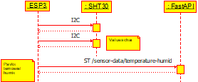

# Detailed design

## User Interface
The user interface is built with React.JS. It communicates with the web server using the REST API and Server-Sent Events.

REQ-DX - The user interface will display current conditions, which are the latest values and their timestamps, obtained from the web server via Server-Sent Events.

REQ-DX - The user interface will display weather station metadata, including:

- Station name
- Latitude and longitude
- Elevation in metres

REQ-DX

## Web server API
The web application provides endpoints for sensor nodes to transmit live readings.

### Temperature and Humidity endpoint
REQ-DX - The temperature and humidity sensor node will transmit data to the following endpoint:

POST /sensor-data

Request body (JSON):

|Field|Type|Units|
|-----|----|-----|
|temperature     |float    |°C     |
|humidity        |int    |%     |

Example payload:
```
{
  "temperature": 24.7,
  "humidity": 63
}
```

### Current conditions endpoint
REQ-DX - The UI will be able to retrieve current weather conditions from the web server via the following Server-Sent Events endpoint:

GET /update-events-sse

Request body (JSON):

None

Response Type:

Server-Sent Events (SSE) stream.
Each `data:` event contains a JSON object representing the most recently known current weather values.

Example SSE Event:
```
data: {"temperature": 24.7, "humidity": 63, "last_update_temperature_and_humidity":"20:32:21"}
```

Event Frequency:

Up to 10 events per second (every 0.1 seconds), but values only truly change when new sensor data arrives.

## Temperature and Humidity sensor node
This sensor node consists of an ESP32-S3, interfaced with an SHT30 temperature and humidity sensor via I2C.

REQ-DX - SHT30 will measure temperature and humidity every 3 seconds, and will transmit to the web server via HTTP POST only when the values change:


## Web server data validation
The web application will validate the received data and discard or flag values that fall outside realistic physical limits.

The following limits apply to validation of values read by the sensor nodes:
|| Variable | Tolerance |
|---|---|---|
| REQ-DX | Temperature | -40°C - 60°C |
| REQ-DX | Humidity | 0% - 100% |

REQ-DX The web server will silently reject values outside these ranges by displaying a null or empty value, and disregarding them for any analysis or calculation.