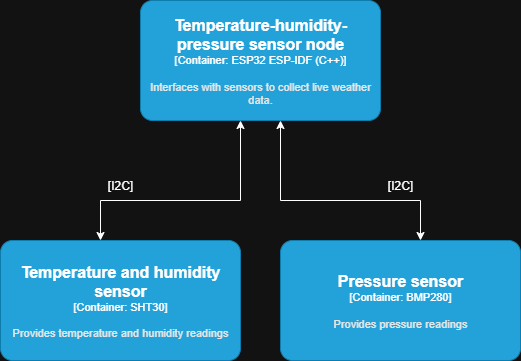
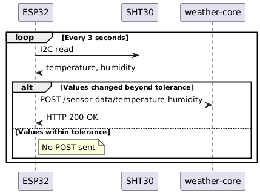

## Temperature Humidity and Pressure sensor node
This sensor node consists of an ESP32-S3, interfaced with an SHT30 temperature and humidity sensor via I2C, and BME280 pressure sensor via I2C. This node is the authoritative source for sensor measurement timestamps, being synced with a NTP time server at startup.

REQ-DX - SHT30 will measure temperature and humidity every 3 seconds, and will transmit to the web server via HTTP POST only when the values change:

## Wind sensor node
This sensor node consists of an ESP32-S3, interfaced with wind speed and direction sensors.

REQ-DX - The wind node samples wind continuously, computes 3-second mean wind speeds, and over each 10-minute observation window calculates the mean wind speed and the maximum 3-second gust. Only the completed 10-minute statistics are transmitted to the server.