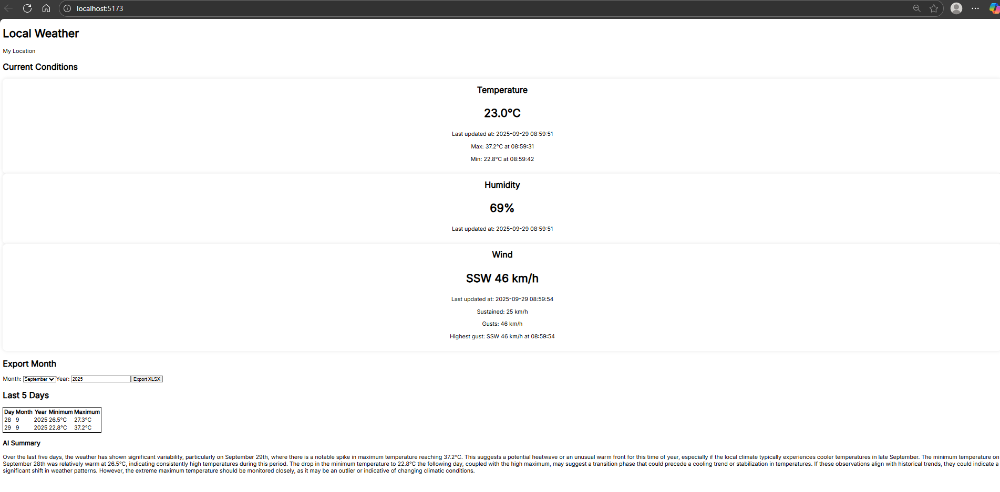

# IoT Weather Station
## Introduction
ESP32 microcontroller-based environmental sensor node, communicating with FastAPI web server via REST API, and React frontend. SHT30 digital temperature and humidity sensor, interfaced with ESP32 via I2C, provides real-time data which is live-streamed to the web dashboard. Daily minimum and maximum temperatures are saved in an Sqlite database, and the last five days of weather are displayed in a table and summarised with LLM integration via OpenAI API.

A sensor simulator (Python script) is provided, to allow testing the web application without interfacing the real ESP32. This simulator generates random temperature and humidity values.

### Project structure
- `dashboard` directory - contains React and FastAPI servers, along with scripts to run the various components.
- `sensorStation\esp32_sht30` directory - contains ESP-IDF project for the sensor node.

## Running
1. Connect ESP32-S3 development board to PC via USB. Make a note of the port in Device Manager (Windows).
2. Start the FastAPI web server (from dashboard project directory):
```
start_api.bat
```
3. Using ESP-IDF CMD, compile and flash the code (from the sensor node project directory):
```
idf.py build
idf.py -p {port} flash monitor
```
If the sensor reads and API calls are successful, there should be an output like the following:
```
I (626) wifi:dp: 1, bi: 102400, li: 3, scale listen interval from 307200 us to 307200 us
I (636) wifi:set rx beacon pti, rx_bcn_pti: 0, bcn_timeout: 25000, mt_pti: 0, mt_time: 10000
I (646) WiFi: handle_wifi_event called: base=WIFI_EVENT, id=4
I (656) wifi:<ba-add>idx:0 (ifx:0, a2:6e:84:76:13:1f), tid:0, ssn:1, winSize:64
I (716) wifi:AP's beacon interval = 102400 us, DTIM period = 1
I (3166) esp_netif_handlers: sta ip: 192.168.1.102, mask: 255.255.255.0, gw: 192.168.1.1
I (3166) WiFi: handle_wifi_event called: base=IP_EVENT, id=0
I (3166) WEATHER_STATION_WIFI: WiFi connected!
I (3166) SensorTask: Running sensor task loop...
I (3196) SHT30Sensor: Read -> Temp=26.2 Hum=57
I (3196) HTTP_POST_TRANSMITTER: Transmitting sensor reading...
I (3576) HTTP_POST_TRANSMITTER: POST OK, status=200
I (6576) SensorTask: Running sensor task loop...
I (6596) SHT30Sensor: Read -> Temp=26.2 Hum=57
I (9596) SensorTask: Running sensor task loop...
I (9616) SHT30Sensor: Read -> Temp=26.2 Hum=57
I (12616) SensorTask: Running sensor task loop...
I (12636) SHT30Sensor: Read -> Temp=26.2 Hum=57
```
4. Start React server (from dashboard project directory):
```
start_react.bat
```



## Challenges faced
I2C was getting timeouts and no data, so port scanning the bus was performed, as well as checking power and signal levels with a multimeter. It was found that the power wire of the SHT30 module was connected to pin 3V3.2 on the board, which wasn't powered. Pin 3V3.1 was powered and the sensor then responded.

## Future features list
- WiFi provisioning to avoid hard-coding SSID and password and web server address.
- Integrate barometric pressure sensor.